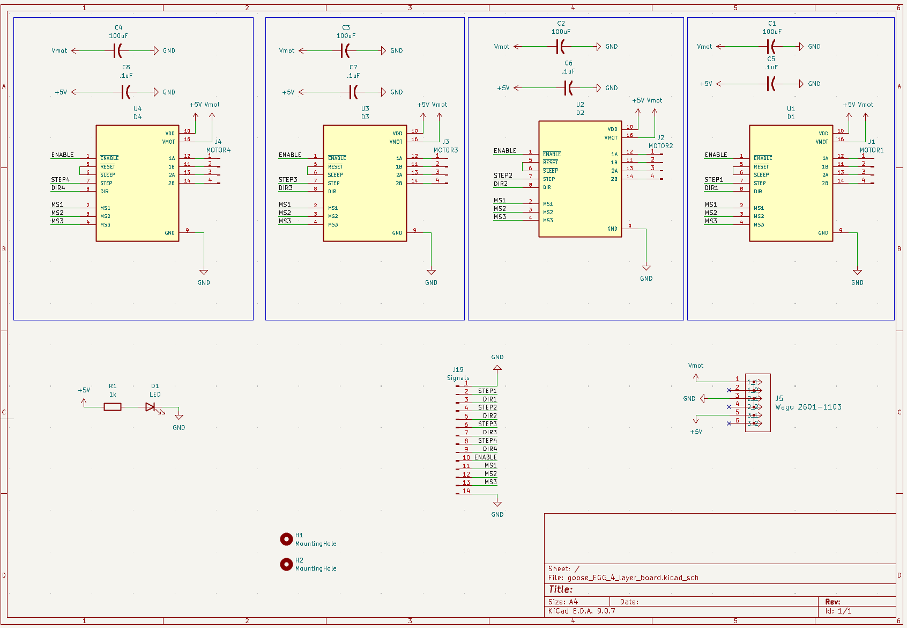
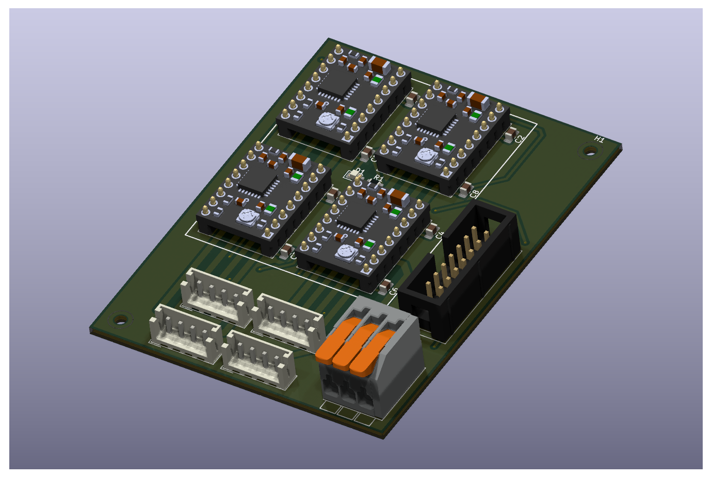
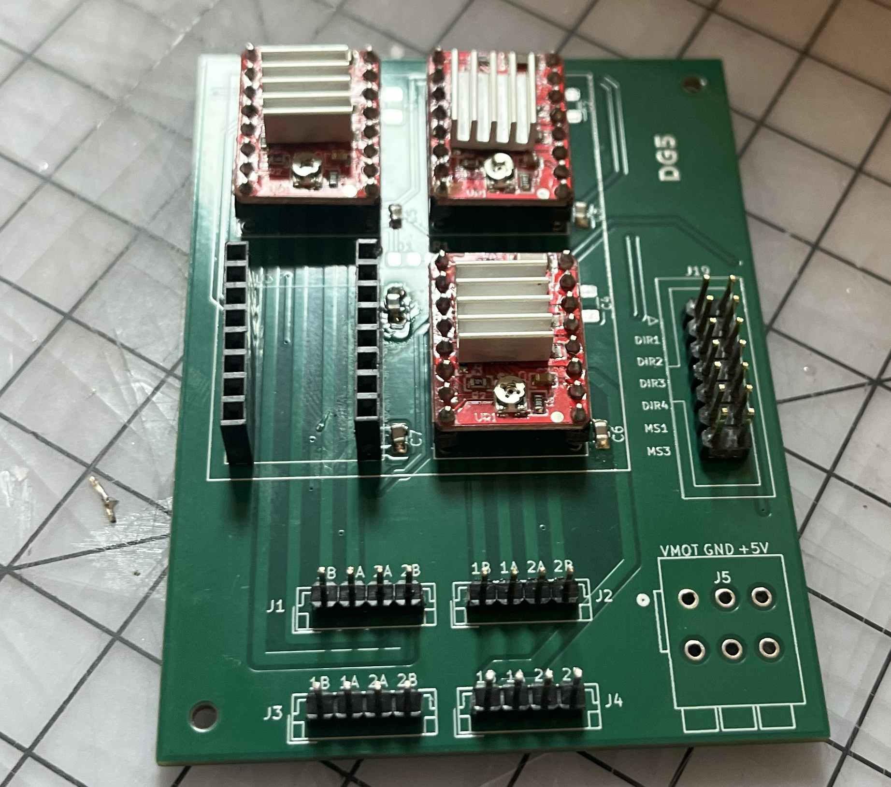

# A4988 Quad Stepper Motor Driver Breakout Board

> A custom-designed 4-channel breakout board for the A4988 stepper motor driver, designed in KiCad for general-purpose stepper motor control applications.

---

## 📸 PCB Preview
> 
> 
> 
> 

---

## 🔍 Overview

This project is a custom PCB breakout board that hosts **four A4988 stepper motor driver ICs** on a single board. The A4988 is a popular microstepping driver commonly used in 3D printers, CNC machines, and robotics. This board consolidates four independent driver channels into a clean, reusable design with proper decoupling and header pinouts for easy integration.

Designed entirely in **KiCad**, including schematic capture, manual PCB layout, trace routing, and Gerber file generation for fabrication readiness.

---

## ✨ Features

- 4 independent A4988 stepper motor driver channels on a single board
- Onboard decoupling capacitors per driver for stable operation
- Breakout headers for STEP, DIR, ENABLE, MS1/MS2/MS3 microstepping pins per channel
- VMOT and GND power rails with bulk capacitor for motor power supply
- Compact layout with clearly labeled silkscreen for easy assembly
- Gerber files included and ready for fabrication (JLCPCB, PCBWay)

---

## ⚙️ A4988 Driver Specs

| Parameter | Value |
|---|---|
| Motor Voltage (VMOT) | 8V – 35V |
| Logic Voltage | 3.3V – 5V |
| Max Current per Channel | 2A (with heatsink) |
| Microstepping Modes | Full, 1/2, 1/4, 1/8, 1/16 |
| Interface | STEP/DIR |

---

## 🛠️ Tools Used

| Tool | Purpose |
|---|---|
| KiCad | Schematic capture & PCB layout |
| KiCad DRC | Design rule checking |
| Gerber Viewer | Fabrication file verification |

---

## 📁 Repository Structure

```
A4988-Quad-Stepper-Breakout/
├── KiCad/
│   ├── stepper_breakout.sch       # Schematic file
│   ├── stepper_breakout.kicad_pcb # PCB layout file
│   └── stepper_breakout.pro       # KiCad project file
├── Gerbers/
│   ├── stepper_breakout.GTL       # Top copper layer
│   ├── stepper_breakout.GBL       # Bottom copper layer
│   ├── stepper_breakout.GTS       # Top soldermask
│   ├── stepper_breakout.GBS       # Bottom soldermask
│   ├── stepper_breakout.GTO       # Top silkscreen
│   └── stepper_breakout.DRL       # Drill file
├── images/
│   ├── schematic.png              # Schematic screenshot
│   └── pcb_layout.png             # PCB layout screenshot
└── README.md
```

---

## 🚀 How to Use

### Open in KiCad
1. Clone this repo:
   ```bash
   git clone https://github.com/MrJoenin/A4988-Quad-Stepper-Breakout.git
   ```
2. Open KiCad → **"Open Existing Project"** → select `stepper_breakout.pro`
3. Open the schematic (`.sch`) or PCB layout (`.kicad_pcb`) to view or modify

### Send for Fabrication
1. Zip the contents of the `Gerbers/` folder
2. Upload to your preferred PCB fab (JLCPCB, PCBWay, OSHPark)
3. Use standard 4-layer, 1.6mm FR4 settings

---

## 🔌 Pinout (Per Channel)

| Pin | Description |
|---|---|
| STEP | Step pulse input |
| DIR | Direction control |
| EN | Enable (active low) |
| MS1/MS2/MS3 | Microstepping mode select |
| VMOT | Motor power supply (8–35V) |
| GND | Common ground |
| 1A/1B/2A/2B | Motor coil outputs |

---

## 🧩 Design Decisions & What I Learned

- **Decoupling capacitors** — placed a 100µF bulk capacitor on VMOT and 100nF ceramic caps per driver to suppress voltage spikes from motor switching
- **Trace width** — used wider traces on the motor power rails to handle higher current without excessive heating
- **DRC cleanup** — ran KiCad's Design Rule Check to catch clearance violations and unconnected nets before generating Gerbers
- **Silkscreen labeling** — labeled all headers clearly so the board is easy to wire without referring back to the schematic

---

## 🔮 Future Improvements

- [ ] Add onboard current limiting trim pots per channel
- [ ] Add LED power indicators per driver
- [ ] Integrate with a microcontroller (Arduino/STM32) header for a fully self-contained motion controller
- [ ] Get the board fabricated and validate against design specs

---

## 👤 Author

**John (MrJoenin)**
- GitHub: [@MrJoenin](https://github.com/MrJoenin)
- LinkedIn: [linkedin.com/in/yourprofile](https://linkedin.com/in/yourprofile)

---

## 📄 License

This project is open source under the [MIT License](LICENSE).
